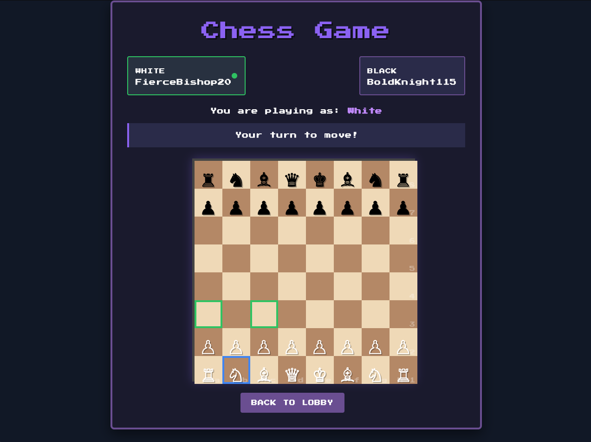

# Retro Chess

A multiplayer chess game with real-time updates built with Elixir and Phoenix LiveView.



## Overview

Retro Chess is a complete implementation of chess with a retro-themed UI. It allows two players to play chess in real-time, with all standard chess rules enforced. The application uses Phoenix LiveView for real-time updates without needing WebSockets code or JavaScript.

## Features

- ♟️ Full implementation of chess rules:
  - Standard piece movements for all pieces
  - Castling (kingside and queenside)
  - En passant captures
  - Pawn promotion
  - Check and checkmate detection
  - Stalemate detection
  - Draws due to insufficient material or fifty-move rule

- 🎮 Retro-style interface:
  - Pixel art styling with "Press Start 2P" font
  - Responsive board that works on both desktop and mobile
  - Visual highlighting of valid moves and checks

- 👥 Multiplayer capabilities:
  - Quick game creation and joining
  - Share a URL to invite opponents
  - Spectator mode for watching games
  - Auto-assignment of colors

- ⚡ Technical features:
  - Real-time updates using Phoenix LiveView
  - Fault-tolerant architecture using Elixir processes
  - Comprehensive test suite
  - Docker support for easy deployment

## Technology Stack

- **Elixir**: Functional programming language
- **Phoenix Framework**: Web framework
- **Phoenix LiveView**: Real-time UI updates without JavaScript
- **Tailwind CSS**: Styling
- **PostgreSQL**: Database for game persistence
- **Docker**: Containerization

## Architecture

The application follows a clean, modular architecture:

- **Board**: Core representation of a chess board and pieces
- **MoveValidator**: Validates moves according to chess rules
- **GameServer**: Manages game state and player interactions
- **LiveView**: Handles the UI and real-time updates

The game logic is completely isolated from the UI, making it easy to test and maintain.

## Getting Started

### Prerequisites

- Elixir 1.17+
- Phoenix 1.7+
- PostgreSQL
- Docker (optional)

### Running Locally

1. Clone the repository:
   ```bash
   git clone https://github.com/gooeytuxedo/chess-elixir.git
   cd chess_app
   ```

2. Install dependencies:
   ```bash
   mix deps.get
   ```

3. Setup the database:
   ```bash
   mix ecto.setup
   ```

4. Start the Phoenix server:
   ```bash
   mix phx.server
   ```

Visit [`localhost:4000`](http://localhost:4000) from your browser.

### Using Docker

1. Build and start the containers:
   ```bash
   docker-compose up -d
   ```

2. Visit [`localhost:4000`](http://localhost:4000) from your browser.

## Running Tests

```bash
mix test
```

## How to Play

1. Visit the homepage and click "Create New Game"
2. Share the game URL with your opponent
3. The first player is automatically assigned white, the second player black
4. Make moves by:
   - Clicking on a piece to select it
   - Click on a highlighted square to move
5. Special moves:
   - Castling: Move your king two squares toward a rook
   - En passant: Capture a pawn that just moved two squares
   - Promotion: Select a piece when your pawn reaches the opposite rank

## Future Enhancements

- Support for chess notation in move history
- Rating system for players
- AI opponents for single-player
- Game analysis tools
- Time controls (chess clock)

## License

MIT License

## Acknowledgments

- [Phoenix Framework](https://phoenixframework.org/)
- [Elixir](https://elixir-lang.org/)
- [Press Start 2P Font](https://fonts.google.com/specimen/Press+Start+2P)